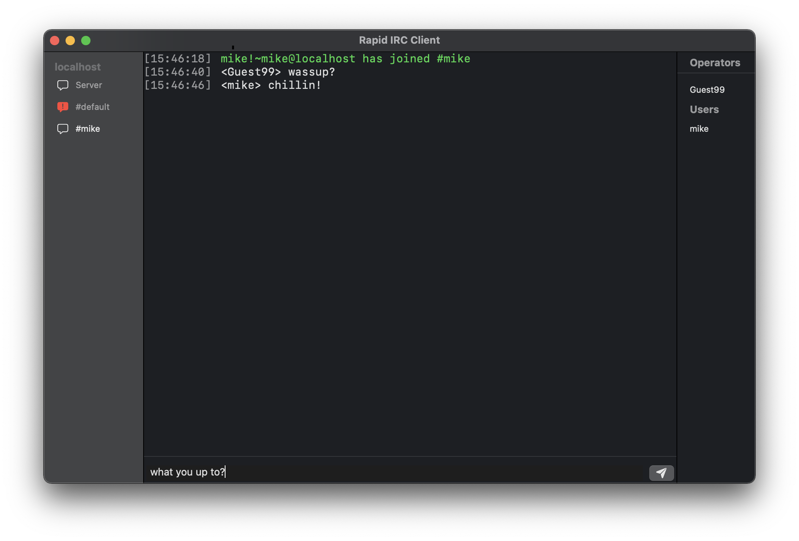

# Rapid IRC Client

An IRC client for macOS built using SwiftUI.

## About

This project is a simple IRC client written using Swift and leveraging the SwiftUI framework. It currently runs on macOS, 
although other iOS platforms might be supported in the future.

## Roadmap

A basic plan for features is listed below. This is subject to change, but as a rough guideline the client should at least
support the following functionality prior to release:

- [X] Connecting and disconnecting to/from servers
- [X] Joining and leaving channels
- [ ] Sending and receiving messages in a channel
- [ ] Private messaging other users
- [ ] User profile and nick customization
- [ ] Channel ops (topics, kicking users, etc.)
- [ ] Fairly robust error handling for invalid messages

## Developing

You'll need macOS 11 or above, and Xcode 12.3 or above. Open the project in Xcode, let it resolve dependencies through
Swift Package Manager, and run the default target to launch the app locally.

As for servers, you _can_ attempt to connect to any real IRC network out there, but for local development it helps to run
a local server to avoid getting banned if a bug in the client causes it to misbehave. [ngIRCd](https://ngircd.barton.de/) is a 
good choice, which you can install in a variety of ways, including Homebrew.

State management uses the wonderful [SwiftRex](https://github.com/SwiftRex/SwiftRex) library along with Combine. This
implements a simple Redux pattern where state changes flow in one direction from a central store.

## Contributing

All contributions are welcome! Feel free to open a pull request if there is something you'd like to pitch in for the project. 
